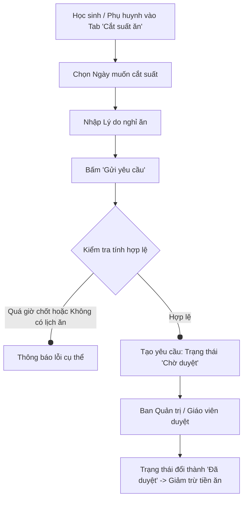

# HƯỚNG DẪN THAO TÁC NGHIỆP VỤ SỬ DỤNG PHẦN MỀM BÁN TRÚ
### CỔNG DÀNH CHO HỌC SINH & PHỤ HUYNH — TRƯỜNG THPT TEN LƠ MAN

---

## MỤC LỤC
1. [Giới thiệu tổng quan](#1-giới-thiệu-tổng-quan)
2. [Hướng dẫn Đăng nhập & Đổi mật khẩu lần đầu](#2-hướng-dẫn-đăng-nhập--đổi-mật-khẩu-lần-đầu)
   * [2.1. Địa chỉ truy cập & Mã QR](#21-địa-chỉ-truy-cập--mã-qr)
   * [2.2. Thông tin đăng nhập bảo mật 3 yếu tố](#22-thông-tin-đăng-nhập-bảo-mật-3-yếu-tố)
   * [2.3. Các bước đăng nhập](#23-các-bước-đăng-nhập)
   * [2.4. Bắt buộc đổi mật khẩu trong lần đăng nhập đầu tiên](#24-bắt-buộc-đổi-mật-khẩu-trong-lần-đăng-nhập-đầu-tiên)
3. [Giao diện Trang chủ & Hồ sơ học sinh](#3-giao-diện-trang-chủ--hồ-sơ-học-sinh)
4. [Nghiệp vụ 1: Báo Cắt suất ăn](#4-nghiệp-vụ-1-báo-cắt-suất-ăn)
5. [Nghiệp vụ 2: Đăng ký Đổi món ăn](#5-nghiệp-vụ-2-đăng-ký-đổi-món-ăn)
6. [Nghiệp vụ 3: Xem Công nợ & Thanh toán Tiền ăn Trực tuyến](#6-nghiệp-vụ-3-xem-công-nợ--thanh-toán-tiền-ăn-trực-tuyến)
7. [Nghiệp vụ 4: Tra cứu Lịch sử Hóa đơn & Giao dịch](#7-nghiệp-vụ-4-tra-cứu-lịch-sử-hóa-đơn--giao-dịch)
8. [Hướng dẫn Đăng xuất an toàn](#8-hướng-dẫn-đăng-xuất-an-toàn)
9. [Những lưu ý quan trọng & Câu hỏi thường gặp (FAQ)](#9-những-lưu-ý-quan-trọng--câu-hỏi-thường-gặp-faq)

---

## 1. GIỚI THIỆU TỔNG QUAN

Hệ thống **Quản lý Suất ăn Bán trú - Trường THPT Ten Lơ Man (BAN-TRU-TLM)** được xây dựng nhằm hiện đại hóa công tác quản lý bán trú, tạo sự thuận tiện, minh bạch và nhanh chóng cho Học sinh và Quý phụ huynh.

### Cổng Học sinh & Phụ huynh cung cấp các tiện ích:
* **Báo cắt suất ăn trực tuyến**: Giảm trừ tiền ăn trực tiếp vào hóa đơn khi học sinh nghỉ học có báo trước.
* **Đổi món ăn linh hoạt**: Đổi tạm thời giữa Cơm mặn, Cơm chay, Cháo theo ngày.
* **Xem công nợ tiền ăn theo thời gian thực**: Nắm rõ số ngày ăn dự kiến, số ngày đã cắt suất, số tiền phải nộp.
* **Thanh toán VietQR tự động**: Quét mã QR thanh toán qua ứng dụng ngân hàng, gạch nợ tự động trong 1 - 3 giây.
* **Minh bạch lịch sử hóa đơn & giao dịch**: Tra cứu chi tiết từng đợt nộp tiền trong cả năm học.

> [!NOTE]
> Hệ thống hoạt động tốt trên mọi thiết bị: Máy tính để bàn, Laptop, Máy tính bảng và Điện thoại thông minh (giao diện tối ưu cho màn hình di động).

---

## 2. HƯỚNG DẪN ĐĂNG NHẬP & ĐỔI MẬT KHẨU LẦN ĐẦU

### 2.1. Địa chỉ truy cập & Mã QR
* Đường dẫn truy cập trực tiếp: [https://bantrutlm.com/student-login](https://bantrutlm.com/student-login)
* (Hoặc truy cập trang đăng nhập chung `/login` và chọn Cổng học sinh).
* **Quét mã QR bằng camera điện thoại để truy cập nhanh:**


```
   ┌─────────────────────────────────────────────────────────────┐
   │             TRƯỜNG THPT TEN LƠ MAN                          │
   │      CỔNG ĐĂNG NHẬP DÀNH CHO HỌC SINH & PHỤ HUYNH           │
   │                                                             │
   │  ┌───────────────────────────────────────────────────────┐  │
   │  │  Họ và tên Học sinh:    [ Nguyễn Văn An              ]│  │
   │  │  Mật khẩu (Ngày sinh):  [ 15082008                   ]│  │
   │  │  Mã xác nhận (6 số CCCD):[ 123456                    ]│  │
   │  │                                                       │  │
   │  │                    [ ĐĂNG NHẬP ]                         │  │
   │  └───────────────────────────────────────────────────────┘  │
   └─────────────────────────────────────────────────────────────┘
```

### 2.2. Thông tin đăng nhập bảo mật 3 yếu tố
Để đảm bảo đúng học sinh và bảo mật thông tin tài chính, hệ thống yêu cầu 3 trường thông tin:

| Trường thông tin | Hướng dẫn nhập | Ví dụ minh họa |
| :--- | :--- | :--- |
| **1. Họ và tên học sinh** | Nhập đầy đủ Họ và tên học sinh theo danh sách trường (hệ thống hỗ trợ cả gõ tiếng Việt có dấu hoặc không dấu). | `Nguyễn Văn An` hoặc `Nguyen Van An` |
| **2. Mật khẩu** | Nhập liền **8 chữ số ngày tháng năm sinh** của học sinh theo định dạng `ddmmyyyy`. | Sinh ngày 15/08/2008 → Nhập: `15082008`<br>Sinh ngày 05/02/2009 → Nhập: `05022009` |
| **3. Mã xác nhận** | Nhập **6 chữ số cuối cùng** trong dãy số Căn cước công dân (CCCD) hoặc Mã định danh cá nhân của học sinh. | Số CCCD là `079208012345` → Nhập: `012345` |

### 2.3. Các bước đăng nhập:
1. Nhập chính xác **Họ và tên học sinh**.
2. Nhập **Mật khẩu** (8 số ngày sinh).
3. Nhập **Mã xác nhận** (6 số cuối CCCD).
4. Bấm nút **"Đăng nhập"**.

> [!TIP]
> Nếu hệ thống báo *"Tài khoản bán trú của bạn đã bị ngưng hoạt động"*, điều này có nghĩa học sinh hiện chưa đăng ký tham gia bán trú hoặc đã hoàn tất thủ tục hủy bán trú. Vui lòng liên hệ Giáo viên chủ nhiệm hoặc Ban Quản lý Bán trú để được hỗ trợ.

### 2.4. Bắt buộc đổi mật khẩu trong lần đăng nhập đầu tiên

Nhằm tăng cường tính an toàn và bảo mật thông tin cá nhân cũng như tài chính bán trú của học sinh, khi tài khoản được khởi tạo lần đầu từ dữ liệu nhà trường, hệ thống sẽ kích hoạt chế độ **Bắt buộc đổi mật khẩu**.

```
   ┌─────────────────────────────────────────────────────────────┐
   │                 BẮT BUỘC ĐỔI MẬT KHẨU                       │
   │ Vì lý do bảo mật, bạn cần đổi mật khẩu mặc định (ngày sinh) │
   │ trong lần đăng nhập đầu tiên.                               │
   │                                                             │
   │ Mật khẩu cũ (Ngày sinh):   [ 15082008                   ]   │
   │ Mật khẩu mới:              [ ••••••••••                 ]   │
   │ Nhập lại mật khẩu mới:     [ ••••••••••                 ]   │
   │                                                             │
   │               [ XÁC NHẬN ĐỔI MẬT KHẨU ]                     │
   └─────────────────────────────────────────────────────────────┘
```

#### A. Khi nào màn hình này xuất hiện?
* Ngay sau khi bạn nhấn nút đăng nhập lần đầu tiên thành công bằng Mật khẩu mặc định (8 số ngày sinh), hệ thống sẽ tự động chuyển hướng đến màn hình **"Bắt buộc đổi mật khẩu"** (`/force-change-password`).
* Học sinh/Phụ huynh **bắt buộc phải hoàn tất việc đổi mật khẩu** thì mới có thể vào trang thông tin bán trú.

#### B. Quy tắc đặt mật khẩu mới:
1. **Độ dài tối thiểu**: Mật khẩu mới phải có **ít nhất 6 ký tự** (khuyến khích kết hợp chữ cái và số, ví dụ: `Tenloman@2026`, `An123456`, `Hocsinh2026`...).
2. **Không trùng mật khẩu cũ**: Mật khẩu mới **không được trùng** với mật khẩu mặc định (ngày tháng năm sinh).
3. **Trùng khớp xác nhận**: Ô *"Nhập lại mật khẩu mới"* phải gõ hoàn toàn khớp với ô *"Mật khẩu mới"*.
4. **Lưu giữ cẩn thận**: Hãy ghi nhớ hoặc lưu lại mật khẩu mới để sử dụng cho tất cả các lần đăng nhập tiếp theo.

#### C. Các bước thực hiện:
1. **Mật khẩu cũ (Ngày sinh)**: Nhập lại 8 chữ số ngày tháng năm sinh vừa dùng đăng nhập (VD: `15082008`).
2. **Mật khẩu mới**: Nhập mật khẩu mới do bạn tự đặt (từ 6 ký tự trở lên).
3. **Nhập lại mật khẩu mới**: Gõ lại chính xác mật khẩu mới một lần nữa để xác nhận.
4. Bấm nút **"Xác nhận đổi mật khẩu"**.

#### D. Sau khi đổi mật khẩu thành công:
* Màn hình sẽ thông báo: *"Đổi mật khẩu thành công. Vui lòng đăng nhập lại bằng mật khẩu mới."*
* Hệ thống sẽ tự động đăng xuất và đưa bạn trở về Cổng đăng nhập (`/student-login`).
* **Từ lần đăng nhập thứ hai trở đi**, bạn sử dụng thông tin:
  * **Họ và tên**: Họ và tên học sinh.
  * **Mật khẩu**: **Mật khẩu MỚI** vừa thiết lập *(không dùng ngày sinh nữa)*.
  * **Mã xác nhận**: 6 số cuối CCCD.

---

## 3. GIAO DIỆN TRANG CHỦ & HỒ SƠ HỌC SINH

Sau khi đăng nhập thành công, hệ thống chuyển tới màn hình làm việc chính:

### 3.1. Thanh tiêu đề (Header)
* Logo và tên trường: **Trường THPT Ten Lơ Man - Cổng Học Sinh & Phụ Huynh**.
* Nút **"Đăng xuất"**: Dùng để thoát tài khoản an toàn khi không sử dụng.

### 3.2. Thẻ Thông tin học sinh (Profile Card)
* Mặc định hiển thị tóm tắt: **Họ tên học sinh**, **Lớp học**.
* Bấm nút **"Xem chi tiết"** (hoặc bấm vào khung thẻ) để mở rộng xem đầy đủ hồ sơ:
  * **Số CCCD / Mã định danh**
  * **Ngày tháng năm sinh & Giới tính**
  * **Lớp học**
  * **Chế độ suất ăn mặc định**: Cơm mặn / Cơm chay / Cháo
  * **Số điện thoại phụ huynh**
  * **Trạng thái bán trú**: `Đang ăn bán trú` (màu xanh)

### 3.3. Bốn Tab nghiệp vụ chính
1. **Cắt suất ăn** (Màu đỏ cam)
2. **Đổi món ăn** (Màu xanh lá)
3. **DS công nợ** (Màu cam vàng - Kèm số lượng hóa đơn chưa thanh toán)
4. **Lịch sử thanh toán** (Màu xanh dương)

---

## 4. NGHIỆP VỤ 1: BÁO CẮT SUẤT ĂN

Dùng khi học sinh nghỉ học (bị ốm, gia đình có việc bận, đi thi cử...) để không chuẩn bị suất ăn và **được trừ tiền suất ăn vào hóa đơn cuối tháng**.



### 4.1. Quy tắc & Điều kiện cắt suất
* **Thời gian được báo trước**: Chỉ được báo cắt suất trong **tuần hiện tại**. Hệ thống sẽ tự động mở đăng ký cho tuần kế tiếp từ **Thứ Bảy hàng tuần**.
* **Thời gian chốt (Cutoff Time)**: 
  * Cắt cho ngày hôm sau hoặc các ngày tiếp theo: Có thể gửi bất cứ lúc nào.
  * Cắt cho chính ngày hôm nay: Phải gửi trước **giờ chốt buổi sáng** (theo quy định nhà trường, thường là trước 08:00 sáng). Sau giờ chốt, hệ thống khóa không cho cắt suất ngày hiện tại.
* **Lịch ăn hợp lệ**: Chỉ cắt được vào những ngày lớp của học sinh có lịch ăn bán trú theo Thời khóa biểu (không áp dụng cho Chủ nhật hoặc các ngày lớp không học bán trú).
* **Trùng lặp**: Mỗi ngày học sinh chỉ được gửi duy nhất 1 yêu cầu cắt suất.

### 4.2. Các bước thực hiện
1. Chọn Tab **"Cắt suất ăn"**.
2. Tại mục **"Ngày cắt suất"**: Bấm vào ô lịch và chọn ngày muốn cắt suất.
3. Tại mục **"Lý do"**: Nhập lý do cụ thể (Ví dụ: *Cháu bị sốt nghỉ ốm*, *Gia đình có việc riêng*, *Đi thi học sinh giỏi*...).
4. Nhấn nút **"Gửi yêu cầu"**.
5. Màn hình sẽ thông báo: *"Đã gửi yêu cầu cắt suất thành công. Vui lòng chờ duyệt."*

### 4.3. Theo dõi trạng thái tại "Lịch sử Cắt suất"
Bảng bên cạnh hiển thị danh sách các ngày đã gửi yêu cầu và trạng thái:
* <span style="color:#d97706; font-weight:bold;">Chờ duyệt</span>: Đã ghi nhận trên hệ thống, đang chờ Nhà trường phê duyệt.
* <span style="color:#059669; font-weight:bold;">Đã duyệt</span>: Nhà trường đã duyệt chấp thuận, suất ăn đã được cắt bỏ và số tiền sẽ được khấu trừ vào bảng báo tiền ăn tháng.
* <span style="color:#e11d48; font-weight:bold;">Từ chối</span>: Yêu cầu không hợp lệ hoặc gửi sau giờ quy định.

---

## 5. NGHIỆP VỤ 2: ĐĂNG KÝ ĐỔI MÓN ĂN

Dùng khi học sinh muốn đổi khẩu vị sang loại món ăn khác trong từng ngày cụ thể (ví dụ ngày Rằm/mùng 1 ăn cơm chay, hoặc khi sức khỏe yếu cần ăn cháo) thay vì món ăn mặc định.

### 5.1. Quy tắc & Điều kiện đổi món
* **Thời gian đăng ký**: Phải đăng ký trước **giờ khóa sổ chiều ngày hôm trước** (trước **16:30**). Không thể đổi món cho ngày hôm nay hoặc ngày đã qua.
* **Ràng buộc với Cắt suất**: Nếu ngày hôm đó học sinh đã có yêu cầu Cắt suất ăn đang có hiệu lực (Chờ duyệt hoặc Đã duyệt), hệ thống sẽ từ chối đổi món.
* **Chu kỳ tuần**: Mở đổi món trong tuần hiện tại và mở tuần kế tiếp từ Thứ Bảy.

### 5.2. Các bước thực hiện
1. Chọn Tab **"Đổi món ăn"**.
2. Tại mục **"Ngày đổi món"**: Chọn ngày học sinh muốn đổi món ăn.
3. Tại mục **"Món ăn muốn đổi"**: Chọn 1 trong 3 chế độ:
   * **Cơm mặn**
   * **Cơm chay**
   * **Cháo**
4. Bấm nút **"Gửi yêu cầu"**.

### 5.3. Hủy yêu cầu đổi món (Quay về món mặc định)
* Trong bảng **"Lịch sử Đổi món"**, đối với các ngày trong tương lai (chưa diễn ra), bên cạnh sẽ có nút **"Hủy đổi"**.
* Nếu phụ huynh/học sinh đổi ý muốn quay về chế độ ăn ban đầu, chỉ cần bấm **"Hủy đổi"** và xác nhận.
* Đối với ngày đã qua hoặc ngày hôm nay đã khóa sổ, hệ thống sẽ hiện nhãn **"Đã khóa"** và không thể hủy.

---

## 6. NGHIỆP VỤ 3: XEM CÔNG NỢ & THANH TOÁN TIỀN ĂN TRỰC TUYẾN

Tab **"DS công nợ"** giúp phụ huynh quản lý chi tiết hóa đơn tiền ăn và thực hiện thanh toán online gạch nợ tự động thông qua mã VietQR.

### 6.1. Kiểm tra tình trạng công nợ
* **Trường hợp 1 - Đã hoàn thành**: Nếu không còn hóa đơn nợ, màn hình hiện thông báo tích xanh: *"Không có công nợ tiền ăn - Học sinh hiện không có phiếu báo tiền ăn nào còn nợ"*.
* **Trường hợp 2 - Có hóa đơn nợ**: Hệ thống hiển thị danh sách các phiếu nợ (sắp xếp hóa đơn mới nhất lên đầu).
  * Huy hiệu <span style="color:#e11d48; font-weight:bold;">Chưa thanh toán</span>: Chưa chuyển khoản tiền ăn tháng này.
  * Huy hiệu <span style="color:#d97706; font-weight:bold;">Đã thanh toán một phần</span>: Đã nộp một phần tiền ăn, vẫn còn nợ phần còn lại.

### 6.2. Các thông số trên phiếu tiền ăn
* **Số ngày ăn dự kiến**: Số ngày bán trú của lớp trong tháng theo TKB.
* **Đã duyệt cắt suất**: Số ngày học sinh đã báo cắt suất và được duyệt thành công (được trừ tiền).
* **Tổng tiền hóa đơn**: Tiền ăn thực tế sau khi đã trừ đi các ngày cắt suất.
* **Số tiền CÒN NỢ**: Số tiền phụ huynh cần thanh toán (nếu đã nộp 1 phần thì chỉ hiển thị số tiền còn thiếu).

```
   ┌─────────────────────────────────────────────────────────────┐
   │ HÓA ĐƠN TIỀN ĂN THÁNG 09/2026                 [Chưa thanh toán]│
   ├─────────────────────────────────────────────────────────────┤
   │ Ngày ăn dự kiến: 22 ngày     │ Đã duyệt cắt suất: 2 ngày    │
   │ Tổng tiền hóa đơn: 800.000đ  │ SỐ TIỀN CÒN NỢ: 720.000đ     │
   ├─────────────────────────────────────────────────────────────┤
   │ ┌──────────────┐   HƯỚNG DẪN CHUYỂN KHOẢN TỰ ĐỘNG GẠCH NỢ   │
   │ │  [ ẢNH MÃ    │   1. Mở App Ngân hàng bất kỳ -> Quét mã QR │
   │ │   VIETQR ]   │   2. Tiền & Nội dung sẽ tự động điền sẵn   │
   │ │              │                                            │
   │ │  720.000đ    │   Ngân hàng: BIDV (970418)                 │
   │ └──────────────┘   STK: 96247BANTRUTLM08     [Sao chép]     │
   │                    Nội dung: BSTLM BT00012 T0926 [Sao chép] │
   └─────────────────────────────────────────────────────────────┘
```

### 6.3. Thanh toán qua mã VietQR thông minh (Khuyên dùng - Nhanh nhất)
Hệ thống đã tích hợp sẵn cổng thanh toán tự động với VietQR:
1. Mở ứng dụng Ngân hàng trên điện thoại (Vietcombank, BIDV, Agribank, VietinBank, Techcombank, MBBank, Momo, v.v.).
2. Chọn chức năng **"Quét QR"** (QR Pay).
3. Hướng camera quét **Mã QR** hiển thị trên hóa đơn.
4. Ứng dụng ngân hàng sẽ **tự động điền đầy đủ và chính xác**:
   * Ngân hàng thụ hưởng: **BIDV**
   * Tên tài khoản nhận: **HOANG KIM**
   * Số tiền: Tự động điền đúng **Số tiền CÒN NỢ**.
   * Nội dung chuyển khoản: Tự động sinh mã chuẩn theo mẫu.
5. Phụ huynh kiểm tra lại thông tin và xác nhận chuyển tiền.
6. **Xác nhận tức thì**: Trong vòng **1 - 3 giây** sau khi chuyển khoản thành công, hệ thống sẽ tự động gạch nợ. Trạng thái phiếu sẽ lập tức chuyển thành **"Đã thanh toán đủ"** trên màn hình mà không cần tải lại trang.

### 6.4. Thanh toán bằng chuyển khoản thủ công (Nhập tay)
Trong trường hợp không tiện quét mã QR, phụ huynh có thể chuyển khoản bằng cách bấm nút **"Sao chép"** thông tin:
* **Ngân hàng thụ hưởng**: **BIDV**
* **Số tài khoản**: `96247BANTRUTLM08`
* **Số tiền**: Nhập chính xác số tiền còn nợ trên hóa đơn.
* **Nội dung chuyển khoản (BẮT BUỘC CHÍNH XÁC)**:
  `BSTLM [Mã học sinh hoặc Mã bán trú] T[Tháng][Năm]`
  *(Ví dụ)*: Học sinh có mã `BT00012` nộp tiền ăn tháng 9 năm 2026:
  `BSTLM BT00012 T0926`

> [!WARNING]
> Phụ huynh vui lòng **ghi đúng cú pháp nội dung chuyển khoản** (bấm nút *Sao chép* trên màn hình). Nếu ghi sai nội dung hoặc thiếu mã học sinh, hệ thống không thể tự động nhận diện và gạch nợ ngay lập tức.

---

## 7. TRA CỨU LỊCH SỬ HÓA ĐƠN & GIAO DỊCH

Tab **"Lịch sử thanh toán"** cho phép phụ huynh và học sinh tra cứu toàn bộ hồ sơ tiền ăn của các tháng trong năm học.

### 7.1. Cách tra cứu:
1. Chọn Tab **"Lịch sử thanh toán"**.
2. **Chọn Năm**: Chọn năm học cần tra cứu (ví dụ: 2026).
   * Màn hình sẽ tổng kết nhanh: *Tổng số tiền đã thanh toán trong năm* và *Số hóa đơn đã hoàn tất*.
3. **Chọn Tháng**: Bấm vào Menu xổ xuống **"Chọn tháng cần xem hóa đơn"** và chọn tháng mong muốn (ví dụ: Tháng 09/2026).

### 7.2. Thông tin hiển thị:
* **Chi tiết hóa đơn tháng**:
  * Số ngày ăn bán trú, số ngày đã cắt suất.
  * Tổng tiền hóa đơn, số tiền đã thanh toán, số tiền còn nợ.
  * Nhãn trạng thái: `Đã thanh toán đủ` (màu xanh), `Đã nộp 1 phần` (màu vàng), hoặc `Chưa thanh toán` (màu đỏ).
* **Nhật ký các giao dịch chuyển khoản đã ghi nhận**:
  * Nếu hóa đơn đã được chuyển khoản (kể cả chuyển nhiều lần), hệ thống sẽ liệt kê danh sách từng lần chuyển:
    * Số tiền chuyển: `+800.000đ`
    * Thời gian chuyển khoản chính xác đến từng giây.
    * Nội dung giao dịch ngân hàng kèm mã đối soát SePay.
    * Nhãn xác nhận: `Gạch nợ thành công`.

---

## 8. HƯỚNG DẪN ĐĂNG XUẤT AN TOÀN

Khi hoàn tất các thao tác, đặc biệt khi sử dụng máy tính ở trường, nơi công cộng hoặc mượn thiết bị của người khác:
1. Nhìn lên góc trên cùng bên phải màn hình (thanh tiêu đề).
2. Nhấn vào nút **"Đăng xuất"** (biểu tượng cánh cửa mở).
3. Hệ thống sẽ kết thúc phiên làm việc an toàn và quay trở lại màn hình đăng nhập.

---

## 9. NHỮNG LƯU Ý QUAN TRỌNG & CÂU HỎI THƯỜNG GẶP (FAQ)

### Q1: Tôi nhập đúng Họ tên và Ngày sinh nhưng không đăng nhập được?
* **Kiểm tra Mật khẩu mới**: Nếu bạn đã hoàn thành bước đổi mật khẩu trong lần đăng nhập đầu tiên, vui lòng nhập **Mật khẩu mới** do bạn tự đặt (không còn dùng ngày sinh nữa).
* **Kiểm tra Mã xác nhận**: Đảm bảo đã nhập đúng **6 chữ số cuối của số CCCD / Mã định danh** của học sinh (không phải số điện thoại).
* **Kiểm tra ngày sinh (nếu chưa đổi lần đầu)**: Nhập đủ 8 chữ số `ddmmyyyy`. Ví dụ ngày 5 tháng 2 năm 2008 phải nhập là `05022008` (không nhập `522008`).
* **Kiểm tra Họ tên**: Gõ đúng họ tên học sinh theo danh sách trường (có thể gõ có dấu hoặc không dấu).
* **Trường hợp quên mật khẩu mới**: Vui lòng liên hệ Giáo viên chủ nhiệm hoặc Ban Quản lý Bán trú để được khôi phục (reset) mật khẩu về lại ngày tháng năm sinh ban đầu.

### Q2: Con tôi ốm đột xuất vào buổi sáng, có báo cắt suất kịp không?
* **Có**, nhưng phụ huynh cần đăng nhập và gửi yêu cầu trước **giờ chốt buổi sáng** của nhà trường (thường là **08:00 sáng**).
* Nếu quá giờ chốt, hệ thống sẽ tự động khóa và thông báo *"Đã quá giờ chốt chính thức"*. Khi đó nhà bếp đã chuẩn bị suất ăn nên không thể hoàn tiền ngày đó.

### Q3: Tôi có thể đăng ký cắt suất ăn hoặc đổi món cho tuần sau vào lúc nào?
* Hệ thống sẽ **mở tuần kế tiếp từ Thứ Bảy hàng tuần**. Phụ huynh và học sinh có thể thao tác vào Thứ Bảy hoặc Chủ Nhật để sắp xếp lịch cho cả tuần sau.

### Q4: Đã quét mã VietQR và tài khoản ngân hàng đã trừ tiền nhưng trên web vẫn báo "Chưa thanh toán"?
* Thông thường hệ thống cập nhật chỉ sau **1 - 3 giây**.
* Trong một số trường hợp nghẽn mạng ngân hàng ngoài giờ làm việc hoặc ngân hàng xử lý chậm, có thể mất từ **1 - 5 phút**.
* Phụ huynh hãy bấm nút F5 (hoặc tải lại trang). Nếu đã quá 15 phút vẫn chưa thấy đổi trạng thái, phụ huynh chỉ cần chụp lại biên lai chuyển khoản ngân hàng và gửi cho Giáo viên chủ nhiệm hoặc Ban Quản lý Bán trú để được hỗ trợ gạch nợ thủ công ngay lập tức.

### Q5: Một hóa đơn có thể chia ra chuyển khoản làm nhiều lần được không?
* **Được**. Hệ thống hỗ trợ tính năng thanh toán từng phần.
* Mỗi lần phụ huynh chuyển một số tiền, hệ thống sẽ tự động ghi nhận lần nộp đó, trừ bớt vào số nợ và cập nhật mã VietQR mới với đúng **Số tiền CÒN NỢ thực tế**.

---

### KÊNH HỖ TRỢ & LIÊN HỆ
Khi cần giải đáp thắc mắc hoặc hỗ trợ kỹ thuật, Quý phụ huynh và Học sinh vui lòng liên hệ:
* **Trường THPT Ten Lơ Man**
* **Bộ phận Quản lý Bán trú**: Văn phòng Bán trú trường
* **Giáo viên chủ nhiệm** của lớp học sinh đang theo học.
